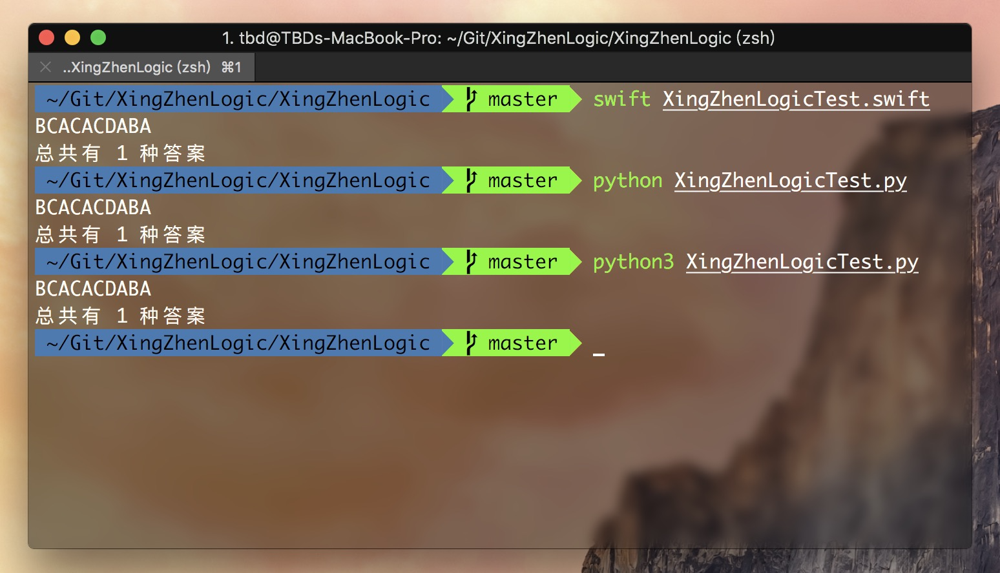

## 使用程序做《2018年刑侦科推理试题》……

### 试题


### 编码过程

刚开始想用四叉树([Tag 1.0](https://github.com/ToBeDefined/XingZhenLogicTest/blob/0.1/XingZhenLogicTest.swift))做遍历，然后进行判断，写了之后发现创建没必要，因为创建了上百万个节点，而且节点信息基本相同，纯属浪费内存…………

于是改成循环遍历。。。节省内存开销同时也提高了速度。。。

后面改写成了Python版本

### 如何运行

#### Swift

```bash
swift XingZhenLogicTest.swift
```

#### Python2.7

```bash
python XingZhenLogicTest.py
```

#### Python3

```bash
python3 XingZhenLogicTest.py
```

### 运行结果



